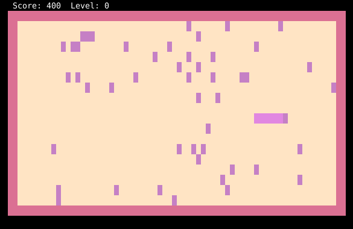
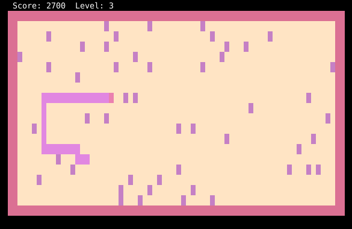
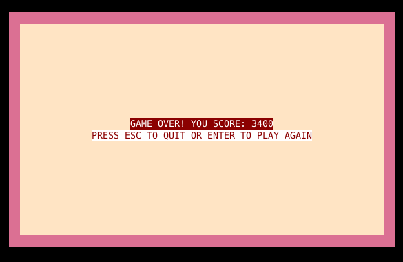

<p align="center">
  <h3 align="center">gosnake</h3>
  <p align="center">
    <a href="https://github.com/streamdp/gosnake/releases/latest">
      
    </a>
    <a href="https://goreportcard.com/report/github.com/streamdp/gosnake">
      
    </a>
  </p>
</p>
<p align="center">
Another one version of the classic snake game written in golang with a library tcell. This is a test task, I spent about 16 hours to complete it.
</p>

# Build the app

```bash
go build -o bin/gosnake main.go
```

or

```bash
task build
```

# Run the app

```bash
./bin/gosnake
```

or

```
task run
```

# App builtin help

```bash
$ ./gosnake -h
gosnake is a version of the classic snake game written in golang with a library tcell.

Usage of ./gosnake:
  -h display help
  -heigth int
     set heigth of the game desk (default 20)
  -limit int
     set heigth of the game desk (default 10)
  -width int
     set width of the game desk (default 70)
```

# Test the app

```bash
./bin/gosnake                                                      
```

<p align="center" width="100%">



</p>
